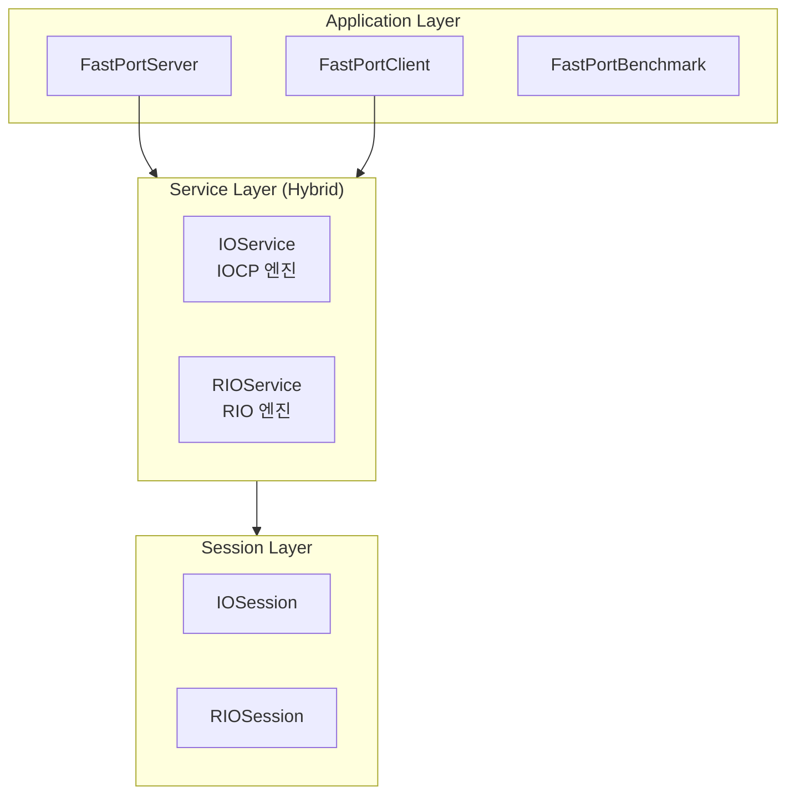

# FastPort

[English](./README.md) | [한국어](./README.ko.md)

**Windows IOCP 및 RIO 기반 고성능 비동기 네트워크 프레임워크**

C++20 모듈을 사용하여 구현된 확장 가능한 네트워크 라이브러리로, 전통적인 IOCP와 최신 고성능 Registered I/O(RIO) 확장을 모두 지원합니다.

---

## 🎯 프로젝트 개요

| 항목 | 내용 |
|------|------|
| **목적** | IOCP 및 RIO를 모두 지원하는 고성능 네트워킹 프레임워크 설계 및 구현 |
| **유형** | 개인 프로젝트 |
| **개발 환경** | Windows, Visual Studio 2022 (v145+), C++20 |

---

## 🛠 기술 스택

| 분류 | 기술 |
|------|------|
| **언어** | C++20 (Modules `.ixx`) |
| **비동기 I/O** | Windows **IOCP** & **RIO (Registered I/O)** |
| **네트워크** | Winsock2, AcceptEx, ConnectEx, RIO Extension |
| **직렬화** | Protocol Buffers (protobuf) |
| **로깅** | spdlog |
| **동기화** | SRWLock, std::mutex, atomic |
| **패키지 관리** | vcpkg |

---

## ✨ 핵심 구현 내용

### 1. IOCP 엔진 (기본 모드)
- **비동기 I/O 처리**: 하드웨어 동시성에 최적화된 워커 스레드 풀 및 IOCP 관리.
- **비동기 Accept/Connect**: `AcceptEx`와 `ConnectEx`를 사용한 완전 비동기 연결 관리.
- **Zero-Byte Recv**: 유휴 세션에 대한 커널 페이지 잠금(Page Locking) 리소스 낭비 방지.
- **1-Outstanding Send**: 세션당 하나의 송신 요청만 유지하여 순차 전송 보장 및 커널 리소스 절약.
- **Scatter-Gather I/O**: `WSABUF` 배열을 활용한 Zero-copy 데이터 전송.

### 2. RIO 엔진 (고성능 모드)
- **직접 버퍼 액세스**: `RioBufferManager`를 통해 미리 등록된 메모리 청크를 사용하여 시스템 콜 오버헤드 최소화.
- **대용량 패킷 스트리밍**: **전송 대기 큐(Pending Send Queue)**를 통해 RIO 버퍼 크기를 초과하는 대용량 데이터(예: 1MB)도 안정적으로 분할 전송.
- **Fast-Path 최적화**: 작은 패킷 전송 시 큐를 거치지 않고 버퍼에 직접 기록하여 지연 시간 최소화.

### 3. 안정성 및 신뢰성
- **Backpressure (흐름 제어)**: 대기 중인 데이터 총량을 모니터링하고 안전 제한(기본 10MB)을 초과할 경우 제어하여 메모리 고갈(OOM) 방지.
- **Delayed Consume**: 실제 I/O 완료가 확인된 시점에만 송신 버퍼 데이터를 제거하여 전송 신뢰성 확보.

---

## 🏗 아키텍처

FastPort는 실행 시점에 모드를 선택할 수 있는 듀얼 엔진 구조를 가지고 있습니다.



---

## 🔧 빌드 및 실행

### 요구 사항
- Windows 10 이상
- Visual Studio 2022 이상
- vcpkg 의존성: `spdlog`, `protobuf`, `grpc`, `cxxopts`

### 서버 실행 방법

**1. 기본 (IOCP) 모드:**
```bash
./FastPortServer.exe
```

**2. RIO 모드 (고성능):**
```bash
./FastPortServer.exe --rio
```

### 벤치마크 실행 방법

```bash
# IOCP 성능 측정 (기본)
./FastPortBenchmark.exe --mode iocp

# RIO 성능 측정
./FastPortBenchmark.exe --mode rio
```

---

## 🚀 향후 개선 계획

- [x] **RIO (Registered I/O) 지원**: 핵심 기능 통합 완료.
- [ ] **세션 매니저 고도화**: 멀티 코어 대응 세션 맵 분할 최적화.
- [ ] **메모리 풀 (Object Pool)**: 객체 재사용을 통한 시스템 부하 감소.
- [ ] **TLS/SSL 지원**: 보안 전송 레이어 통합.

---

## 📝 License

MIT License
