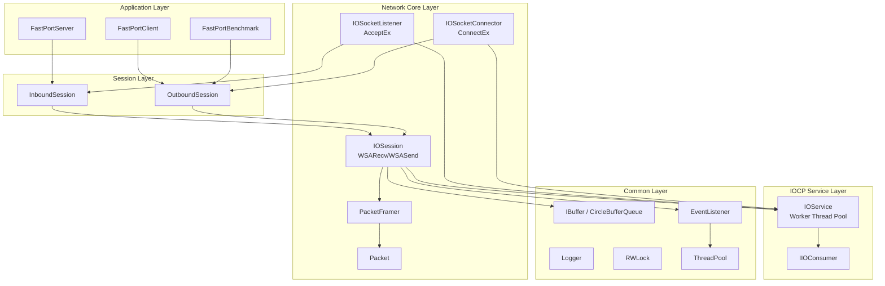
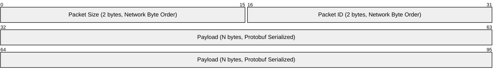

# FastPort

[English](./README.md) | [한국어](./README.ko.md)

**고성능 Windows IOCP 기반 비동기 네트워크 프레임워크**

C++20 모듈을 활용하여 구현한 확장 가능한 네트워크 서버/클라이언트 라이브러리입니다.

---

## 🎯 프로젝트 개요

| 항목 | 내용 |
|------|------|
| **목적** | IOCP 기반 고성능 비동기 네트워킹 프레임워크 설계 및 구현 |
| **유형** | 개인 프로젝트 |
| **개발 환경** | Windows, Visual Studio 2022 (v143+), C++20 |

---

## 🛠 기술 스택

| 분류 | 기술 |
|------|------|
| **언어** | C++20 (Modules `.ixx`) |
| **비동기 I/O** | Windows IOCP (I/O Completion Port) |
| **네트워크** | Winsock2, AcceptEx, ConnectEx, WSARecv, WSASend |
| **직렬화** | Protocol Buffers (protobuf), gRPC |
| **로깅** | spdlog |
| **동기화** | SRWLock, atomic |
| **패키지 관리** | vcpkg |
| **테스트** | Microsoft C++ Unit Test Framework |

---

## 🏗 아키텍처



---

## 📦 패킷 프로토콜



| 필드 | 크기 | 설명 |
|------|------|------|
| **Size** | 2 bytes | 전체 패킷 크기 (헤더 포함), Big-Endian |
| **Packet ID** | 2 bytes | 메시지 타입 식별자, Big-Endian |
| **Payload** | N bytes | Protocol Buffers 직렬화 데이터 |

---

## 📁 프로젝트 구조

```
FastPort/
├─ FastPortServer/           # 서버 애플리케이션
│  ├─ FastPortServer.cpp
│  ├─ FastPortServiceMode.ixx
│  └─ FastPortInboundSession.*
│
├─ FastPortClient/           # 클라이언트 애플리케이션
│  ├─ FastPortClient.cpp
│  └─ FastPortOutboundSession.*
│
├─ FastPortBenchmark/        # 성능 벤치마크 도구
│  ├─ FastPortBenchmark.cpp
│  ├─ LatencyBenchmarkRunner.*
│  ├─ BenchmarkRunner.h
│  ├─ BenchmarkStats.h
│  └─ BenchmarkSession.ixx
│
├─ LibNetworks/              # 네트워크 코어 라이브러리
│  ├─ Socket.*               # Winsock 소켓 래퍼
│  ├─ IOService.*            # IOCP 워커 스레드 관리
│  ├─ IOConsumer.ixx         # IOCP Completion 인터페이스
│  ├─ IOSocketListener.*     # AcceptEx 기반 리스너
│  ├─ IOSocketConnector.*    # ConnectEx 기반 커넥터
│  ├─ IOSession.*            # 세션 I/O 처리 (Zero-Byte Recv, SG I/O)
│  ├─ Packet.ixx             # 패킷 구조체
│  ├─ PacketFramer.ixx       # TCP 스트림 패킷 분리
│  ├─ InboundSession.*       # 서버 세션 베이스
│  └─ OutboundSession.*      # 클라이언트 세션 베이스
│
├─ LibCommons/               # 공용 유틸리티 라이브러리
│  ├─ Logger.*               # spdlog 래핑
│  ├─ RWLock.*               # SRWLock 기반 동기화
│  ├─ ThreadPool.ixx         # 스레드 풀
│  ├─ EventListener.ixx      # 이벤트 리스너 (작업 큐)
│  ├─ IBuffer.ixx            # 버퍼 인터페이스
│  ├─ CircleBufferQueue.ixx  # 원형 버퍼 구현체
│  ├─ Container.ixx          # 타입 안전 컨테이너 유틸리티
│  ├─ SingleTon.ixx          # 싱글톤 템플릿
│  ├─ StrConverter.ixx       # 문자열 변환 유틸리티
│  └─ ServiceMode.ixx        # 서비스 실행 모드 정의
│
├─ Protocols/                # Protocol Buffers 생성 파일
│  └─ *.pb.h, *.pb.cc
│
├─ Protos/                   # .proto 정의 파일
│  ├─ Commons.proto
│  ├─ Tests.proto
│  └─ Benchmark.proto
│
├─ docs/                     # 프로젝트 상세 문서
│
└─ LibCommonsTests/          # 단위 테스트
└─ LibNetworksTests/
```

---

## ✨ 핵심 구현 내용

### 1. IOCP 기반 비동기 I/O 처리

- `IOService`: IOCP 핸들 생성 및 하드웨어 동시성 기반 워커 스레드 풀 관리
- `IIOConsumer`: I/O 완료 통지를 처리하는 인터페이스 기반 설계로 확장성 확보
- `OVERLAPPED` 확장 구조체를 멤버 변수로 관리하여 런타임 힙 할당 최소화

### 2. 비동기 Accept/Connect (AcceptEx / ConnectEx)

- **Pre-posted Accept**: 서버 시작 시 대량의 `AcceptEx`를 미리 게시하여 연결 수락 지연 최소화
- **ConnectEx**: 클라이언트 연결 과정까지 완전 비동기로 처리하여 메인 스레드 블로킹 방지

### 3. 세션 관리 및 전송 보장

- **1-Outstanding Send**: `atomic` 플래그를 사용하여 세션당 하나의 송신 요청만 활성화, 순차 전송 보장 및 커널 리소스 절약
- **Delayed Consume**: 실제 I/O 완료가 확인된 시점에 송신 버퍼 데이터를 소비(Consume)하여 안정성 확보

### 4. 고성능 수신 최적화 (Zero-Byte Recv)

- **Zero-Byte Recv**: 데이터가 없는 유휴 세션에 대해 0바이트 수신 요청을 걸어두어 커널의 페이지 잠금(Page Locking) 리소스 낭비 방지
- 알림 수신 시에만 실제 버퍼를 할당/연결하여 대규모 동시 접속 환경에서 메모리 효율 극대화

### 5. Scatter-Gather I/O (WSABUF)

- **Zero-Copy 송수신**: 링 버퍼의 데이터가 물리적으로 쪼개져 있는 경우에도 임시 복사본을 만들지 않고 `WSABUF` 배열을 통해 커널에 직접 전달

### 6. 계층 분리 설계

| 계층 | 역할 | 주요 클래스 |
|------|------|------------|
| Application | 비즈니스 로직 및 서비스 구동 | `FastPortServer`, `FastPortClient`, `FastPortBenchmark` |
| Session | 세션 상태 및 도메인 로직 관리 | `InboundSession`, `OutboundSession` |
| Network Core | Winsock 추상화 및 I/O 수행 | `IOSession`, `PacketFramer`, `Socket` |
| IOCP Service | 시스템 레벨 I/O 관리 | `IOService`, `IIOConsumer` |
| Common | 기반 기술 및 유틸리티 | `IBuffer`, `Logger`, `ThreadPool`, `EventListener` |

---

## 🔧 빌드 및 실행

### 요구 사항

- Windows 10 이상
- Visual Studio 2022 이상
- vcpkg (패키지 관리)

### 의존성 설치

```bash
vcpkg install spdlog protobuf grpc cxxopts
```

### 빌드

1. `FastPort.slnx` 솔루션 파일 열기 (Visual Studio 2022 17.10+ 권장)
2. `x64` 플랫폼 및 `Release` 구성을 권장
3. 전체 빌드 수행 (Ctrl+Shift+B)

---

## 📊 벤치마크 및 결과

성능 최적화 단계별 벤치마크 결과는 `docs/` 내 문서에서 확인할 수 있습니다.

- [01. Baseline 측정](docs/benchmark-results-01-baseline.md)
- [02. Scatter-Gather 적용 결과](docs/benchmark-results-02-scatter-gather.md)
- [03. Zero-Copy Send 적용 결과](docs/benchmark-results-03-zero-copy-send.md)

---

## 📚 상세 문서

| 문서 | 설명 |
|------|------|
| [프로젝트 구조](docs/PROJECT_STRUCTURE.md) | 상세 디렉터리 및 파일 역할 정의 |
| [IOCP 아키텍처](docs/ARCHITECTURE_IOCP.md) | 상세 설계 및 I/O 흐름도 |
| [패킷 프로토콜](docs/PACKET_PROTOCOL.md) | 헤더 구조 및 직렬화 방식 명세 |
| [모듈 의존성](docs/MODULE_DEPENDENCIES.md) | C++20 모듈 간 참조 관계 |
| [빌드 가이드](docs/BUILD_GUIDE.md) | 환경 설정 및 트러블슈팅 |
| [벤치마크 가이드](docs/BENCHMARK_GUIDE.md) | 성능 측정 도구 사용법 |
| [C++ 현대적 기능 활용](docs/CPP_MODERN_FEATURES.md) | 사용된 C++20/23 기능 설명 |

---

## 🚀 향후 개선 계획

- [ ] **RIO (Registered I/O) 지원**: Windows 최신 고성능 I/O API 적용 ([ARCHITECTURE_RIO.md](docs/ARCHITECTURE_RIO.md))
- [ ] **세션 매니저 고도화**: 멀티 코어 대응 세션 맵 분할 및 브로드캐스트 최적화
- [ ] **메모리 풀 (Object Pool)**: 세션 및 패킷 객체 재사용을 통한 GC 부하 감소
- [ ] **TLS/SSL 지원**: 보안 전송 레이어 통합

---

## 📝 License

MIT License
