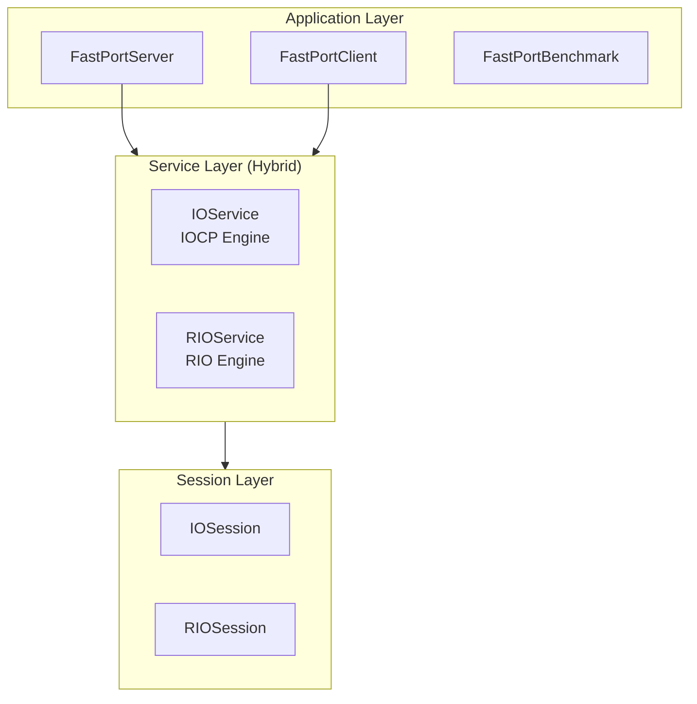

# FastPort

[English](./README.md) | [한국어](./README.ko.md)

**High-Performance Asynchronous Network Framework based on Windows IOCP & RIO**

A scalable network server/client library implemented using C++20 modules, supporting both traditional IOCP and the high-performance Registered I/O (RIO) extensions.

---

## 🎯 Project Overview

| Item | Description |
|------|-------------|
| **Goal** | Design and implementation of a high-performance networking framework supporting IOCP and RIO |
| **Type** | Personal Project |
| **Dev Environment** | Windows, Visual Studio 2022 (v145+), C++20 |

---

## 🛠 Tech Stack

| Category | Technology |
|----------|------------|
| **Language** | C++20 (Modules `.ixx`) |
| **Async I/O** | Windows **IOCP** & **RIO (Registered I/O)** |
| **Network** | Winsock2, AcceptEx, ConnectEx, RIO Extension |
| **Serialization** | Protocol Buffers (protobuf) |
| **Logging** | spdlog |
| **Synchronization** | SRWLock, std::mutex, atomic |
| **Package Management** | vcpkg |

---

## ✨ Key Implementations

### 1. IOCP Engine (Default Mode)
- **Asynchronous I/O**: Efficient worker thread pool management based on hardware concurrency.
- **Async Accept/Connect**: Uses `AcceptEx` and `ConnectEx` for fully non-blocking connection management.
- **Zero-Byte Recv**: Minimizes kernel page locking resources for idle sessions.
- **1-Outstanding Send**: Ensures sequential transmission and saves kernel resources.
- **Scatter-Gather I/O**: Zero-copy data transfer using `WSABUF` arrays.

### 2. RIO Engine (High-Performance Mode)
- **Direct Buffer Access**: Minimizes overhead by using pre-registered memory chunks via `RioBufferManager`.
- **Large Packet Streaming**: Supports seamless transfer of packets exceeding the RIO buffer size (e.g., 1MB packet through 64KB buffer) via a specialized **Pending Send Queue**.
- **Fast-Path Optimization**: Bypasses queueing for small packets when buffer space is available to minimize latency.

### 3. Reliability & Safety
- **Backpressure**: Monitors pending data volume and enforces a safety limit (default 10MB) to prevent memory exhaustion (OOM).
- **Delayed Consume**: Data is only removed from the send buffer after actual I/O completion is confirmed.

---

## 🏗 Architecture

FastPort provides a dual-engine architecture where the network mode can be switched at runtime.



---

## 🔧 Build and Run

### Requirements
- Windows 10 or higher
- Visual Studio 2022 or higher
- vcpkg: `vcpkg install spdlog protobuf grpc cxxopts`

### Running the Server

**1. Default (IOCP) Mode:**
```bash
./FastPortServer.exe
```

**2. RIO Mode (High Performance):**
```bash
./FastPortServer.exe --rio
```

### Running the Benchmark

```bash
# Measure IOCP performance (Default)
./FastPortBenchmark.exe --mode iocp

# Measure RIO performance
./FastPortBenchmark.exe --mode rio
```

---

## 🚀 Future Roadmap

- [x] **RIO (Registered I/O) Support**: Core integration completed.
- [ ] **Advanced Session Manager**: Optimized session map partitioning.
- [ ] **Object Pooling**: Reduce GC overhead by reusing objects.
- [ ] **TLS/SSL Support**: Integration of secure transmission layer.

---

## 📝 License

MIT License