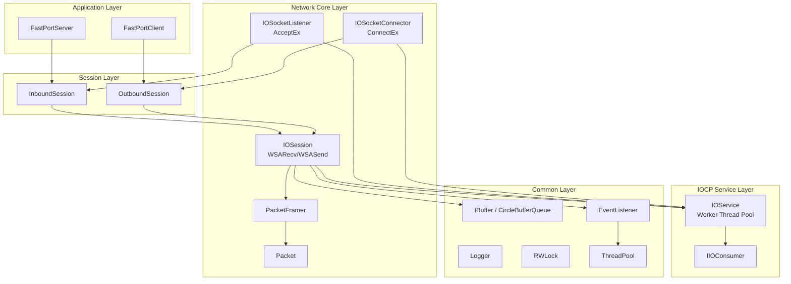
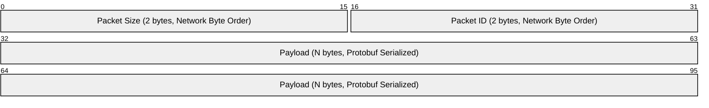
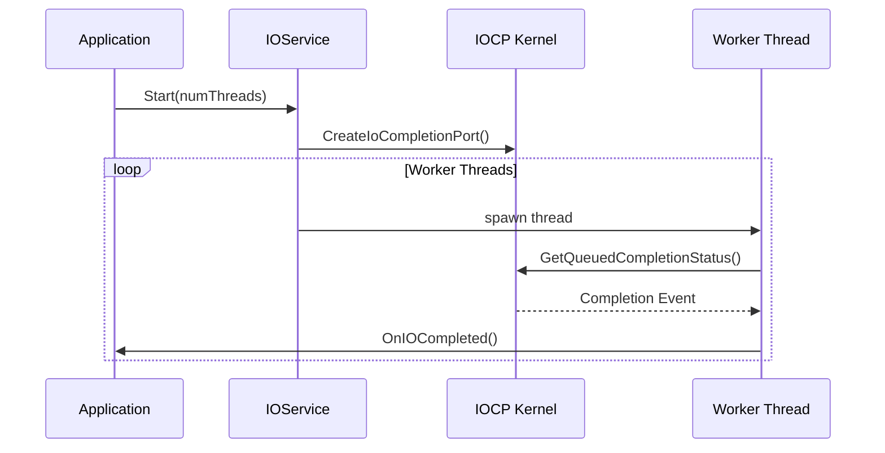
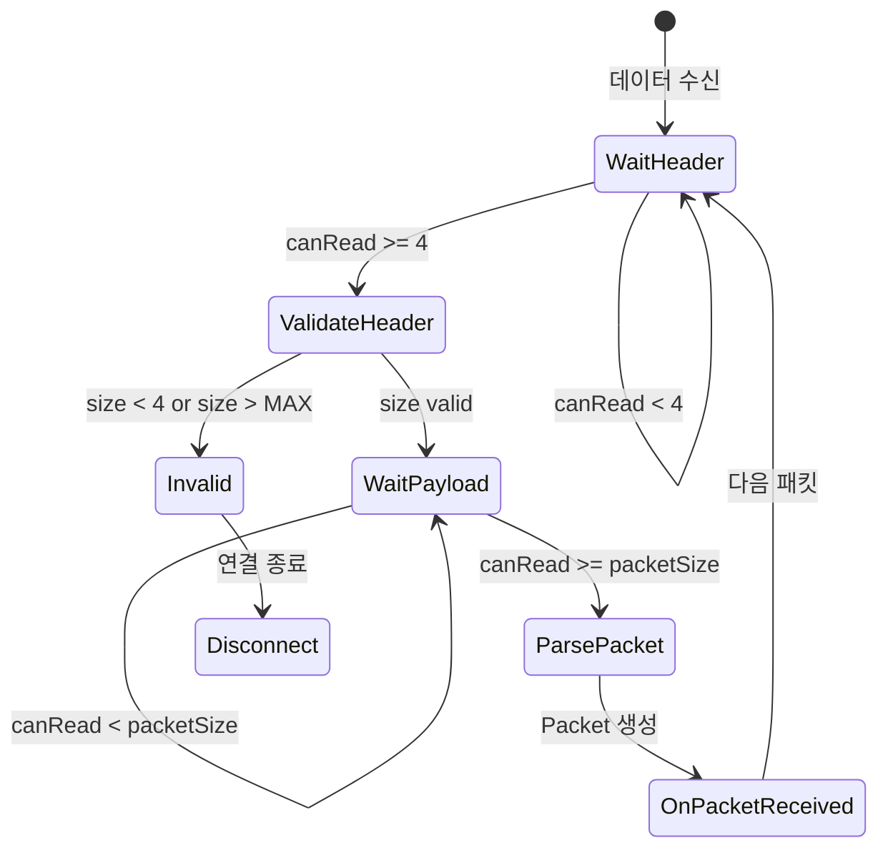

# FastPort

**고성능 Windows IOCP 기반 비동기 네트워크 프레임워크**

C++20 모듈을 활용하여 구현한 확장 가능한 네트워크 서버/클라이언트 라이브러리입니다.

---

## 🎯 프로젝트 개요

| 항목 | 내용 |
|------|------|
| **목적** | IOCP 기반 고성능 비동기 네트워킹 프레임워크 설계 및 구현 |
| **유형** | 개인 프로젝트 |
| **개발 환경** | Windows, Visual Studio 2022+, C++20 |

---

## 🛠 기술 스택

| 분류 | 기술 |
|------|------|
| **언어** | C++20 (Modules `.ixx`) |
| **비동기 I/O** | Windows IOCP (I/O Completion Port) |
| **네트워크** | Winsock2, AcceptEx, ConnectEx, WSARecv, WSASend |
| **직렬화** | Protocol Buffers (protobuf), gRPC |
| **로깅** | spdlog |
| **동기화** | SRWLock, atomic |
| **패키지 관리** | vcpkg |
| **테스트** | Microsoft C++ Unit Test Framework |

---

## 🏗 아키텍처



---

## 📦 패킷 프로토콜



| 필드 | 크기 | 설명 |
|------|------|------|
| **Size** | 2 bytes | 전체 패킷 크기 (헤더 포함), Big-Endian |
| **Packet ID** | 2 bytes | 메시지 타입 식별자, Big-Endian |
| **Payload** | N bytes | Protocol Buffers 직렬화 데이터 |

---

## 📁 프로젝트 구조

```
FastPort/
├─ FastPortServer/           # 서버 애플리케이션
│  ├─ FastPortServer.cpp
│  ├─ FastPortServiceMode.ixx
│  └─ FastPortInboundSession.*
│
├─ FastPortClient/           # 클라이언트 애플리케이션
│  ├─ FastPortClient.cpp
│  └─ FastPortOutboundSession.*
│
├─ LibNetworks/              # 네트워크 코어 라이브러리
│  ├─ Socket.*               # Winsock 소켓 래퍼
│  ├─ IOService.*            # IOCP 워커 스레드 관리
│  ├─ IOConsumer.ixx         # IOCP Completion 인터페이스
│  ├─ IOSocketListener.*     # AcceptEx 기반 리스너
│  ├─ IOSocketConnector.*    # ConnectEx 기반 커넥터
│  ├─ IOSession.*            # 세션 I/O 처리
│  ├─ Packet.ixx             # 패킷 구조체
│  ├─ PacketFramer.ixx       # TCP 스트림 패킷 분리
│  ├─ InboundSession.*       # 서버 세션 베이스
│  └─ OutboundSession.*      # 클라이언트 세션 베이스
│
├─ LibCommons/               # 공용 유틸리티 라이브러리
│  ├─ Logger.*               # spdlog 래핑
│  ├─ RWLock.*               # SRWLock 기반 동기화
│  ├─ ThreadPool.ixx         # 스레드 풀
│  ├─ EventListener.ixx      # 이벤트 리스너 (작업 큐)
│  ├─ IBuffer.ixx            # 버퍼 인터페이스
│  └─ CircleBufferQueue.ixx  # 원형 버퍼 구현체
│
├─ Protocols/                # Protocol Buffers 생성 파일
│  └─ *.pb.h, *.pb.cc
│
├─ Protos/                   # .proto 정의 파일
│  ├─ Commons.proto
│  └─ Tests.proto
│
└─ Tests/                    # 단위 테스트
   ├─ LibCommonsTests/
   └─ LibNetworksTests/
```

---

## ✨ 핵심 구현 내용

### 1. IOCP 기반 비동기 I/O 처리



- `IOService`: IOCP 핸들 생성 및 워커 스레드 풀 관리
- `IIOConsumer`: Completion 이벤트 콜백 인터페이스로 확장성 확보
- 하드웨어 동시성 기반 스레드 수 자동 조정

### 2. 비동기 Accept/Connect

- **AcceptEx**: Pre-posted accept로 연결 수락 지연 최소화
- **ConnectEx**: 비동기 연결로 블로킹 없는 클라이언트 구현

### 3. 세션 관리 및 메모리 최적화

- `OVERLAPPED` 구조체 멤버 변수 재사용으로 힙 할당 최소화
- `m_SendInProgress` atomic 플래그로 동시 전송 1개 유지 (순차 전송 보장)
- Send/Recv 버퍼를 인터페이스(`IBuffer`)로 분리하여 DI 패턴 적용

### 4. TCP 스트림 패킷 프레이밍



- `PacketFramer`: TCP 스트림에서 패킷 단위 분리
- `PacketFrameResult`: `Ok` / `NeedMore` / `Invalid` 3상태 분리
- Network Byte Order (Big-Endian) 헤더 처리 (`htons`/`ntohs`)

### 5. 원형 버퍼 큐 (CircleBufferQueue)

- `Write/Peek/Pop/Consume` 기반 스트림 처리
- `RWLock`을 통한 스레드 안전성 보장
- 메모리 재할당 없이 연속적인 데이터 처리

### 6. 계층 분리 설계

| 계층 | 역할 | 주요 클래스 |
|------|------|------------|
| Application | 비즈니스 로직 | `FastPortServer`, `FastPortClient` |
| Session | 세션 상태 관리 | `InboundSession`, `OutboundSession` |
| Network Core | I/O 처리 | `IOSession`, `PacketFramer`, `Packet` |
| IOCP Service | 스레드 관리 | `IOService`, `IIOConsumer` |
| Common | 공용 유틸 | `IBuffer`, `Logger`, `ThreadPool` |

---

## 🔧 빌드 및 실행

### 요구 사항

- Windows 10 이상
- Visual Studio 2022 이상
- C++20 지원 컴파일러
- vcpkg (패키지 관리)

### 의존성 설치

```bash
vcpkg install spdlog:x64-windows
vcpkg install protobuf:x64-windows
vcpkg install grpc:x64-windows
```

### 빌드

1. `FastPort.slnx` 솔루션 파일 열기
2. 빌드 구성 선택 (Debug/Release, x64)
3. 솔루션 빌드 (Ctrl+Shift+B)

### 실행

```powershell
# 서버 실행
.\FastPortServer.exe

# 클라이언트 실행 (별도 터미널)
.\FastPortClient.exe
```

---

## 📊 기술적 의사결정

| 결정 사항 | 선택 | 이유 |
|-----------|------|------|
| 비동기 모델 | IOCP | Windows 환경 최고 성능의 비동기 I/O 모델 |
| 모듈 시스템 | C++20 Modules | 컴파일 시간 단축, 명확한 인터페이스 분리 |
| 버퍼 설계 | 원형 버퍼 + 인터페이스 | 메모리 효율성 및 구현체 교체 용이성 |
| 패킷 엔디안 | Network Byte Order | 플랫폼 독립적 통신, 표준 준수 |
| 동기화 | SRWLock + atomic | 읽기 작업 빈번 시 성능 우위, lock-free 패턴 |
| 직렬화 | Protocol Buffers | 언어 중립적, 효율적인 바이너리 직렬화 |

---

## 📝 License

MIT License
