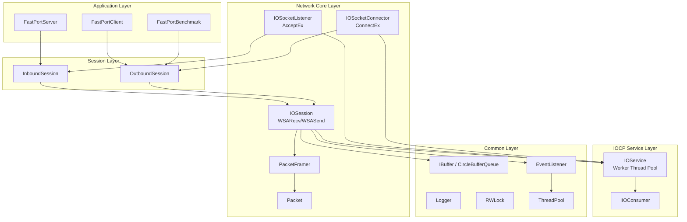
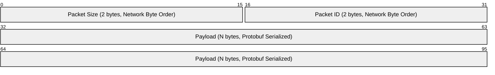

# FastPort

[English](./README.md) | [한국어](./README.ko.md)

**High-Performance Asynchronous Network Framework based on Windows IOCP**

A scalable network server/client library implemented using C++20 modules.

---

## 🎯 Project Overview

| Item | Description |
|------|-------------|
| **Goal** | Design and implementation of a high-performance asynchronous networking framework based on IOCP |
| **Type** | Personal Project |
| **Dev Environment** | Windows, Visual Studio 2022 (v143+), C++20 |

---

## 🛠 Tech Stack

| Category | Technology |
|----------|------------|
| **Language** | C++20 (Modules `.ixx`) |
| **Async I/O** | Windows IOCP (I/O Completion Port) |
| **Network** | Winsock2, AcceptEx, ConnectEx, WSARecv, WSASend |
| **Serialization** | Protocol Buffers (protobuf), gRPC |
| **Logging** | spdlog |
| **Synchronization** | SRWLock, atomic |
| **Package Management** | vcpkg |
| **Testing** | Microsoft C++ Unit Test Framework |

---

## 🏗 Architecture



---

## 📦 Packet Protocol



| Field | Size | Description |
|-------|------|-------------|
| **Size** | 2 bytes | Total packet size (including header), Big-Endian |
| **Packet ID** | 2 bytes | Message type identifier, Big-Endian |
| **Payload** | N bytes | Protocol Buffers serialized data |

---

## 📁 Project Structure

```
FastPort/
├─ FastPortServer/           # Server Application
│  ├─ FastPortServer.cpp
│  ├─ FastPortServiceMode.ixx
│  └─ FastPortInboundSession.*
│
├─ FastPortClient/           # Client Application
│  ├─ FastPortClient.cpp
│  └─ FastPortOutboundSession.*
│
├─ FastPortBenchmark/        # Performance Benchmark Tool
│  ├─ FastPortBenchmark.cpp
│  ├─ LatencyBenchmarkRunner.*
│  ├─ BenchmarkRunner.h
│  ├─ BenchmarkStats.h
│  └─ BenchmarkSession.ixx
│
├─ LibNetworks/              # Core Network Library
│  ├─ Socket.*               # Winsock socket wrapper
│  ├─ IOService.*            # IOCP worker thread management
│  ├─ IOConsumer.ixx         # IOCP completion interface
│  ├─ IOSocketListener.*     # AcceptEx-based listener
│  ├─ IOSocketConnector.*    # ConnectEx-based connector
│  ├─ IOSession.*            # Session I/O handling (Zero-Byte Recv, SG I/O)
│  ├─ Packet.ixx             # Packet structure
│  ├─ PacketFramer.ixx       # TCP stream packet framing
│  ├─ InboundSession.*       # Server session base
│  └─ OutboundSession.*      # Client session base
│
├─ LibCommons/               # Common Utility Library
│  ├─ Logger.*               # spdlog wrapper
│  ├─ RWLock.*               # SRWLock-based synchronization
│  ├─ ThreadPool.ixx         # Thread pool
│  ├─ EventListener.ixx      # Event listener (task queue)
│  ├─ IBuffer.ixx            # Buffer interface
│  ├─ CircleBufferQueue.ixx  # Circular buffer implementation
│  ├─ Container.ixx          # Type-safe container utilities
│  ├─ SingleTon.ixx          # Singleton template
│  ├─ StrConverter.ixx       # String conversion utilities
│  └─ ServiceMode.ixx        # Service execution mode definitions
│
├─ Protocols/                # Generated Protocol Buffers files
│  └─ *.pb.h, *.pb.cc
│
├─ Protos/                   # .proto definition files
│  ├─ Commons.proto
│  ├─ Tests.proto
│  └─ Benchmark.proto
│
├─ docs/                     # Detailed project documentation
│
└─ LibCommonsTests/          # Unit Tests
└─ LibNetworksTests/
```

---

## ✨ Key Implementations

### 1. IOCP-based Asynchronous I/O Handling

- `IOService`: Manages IOCP handles and worker thread pools based on hardware concurrency.
- `IIOConsumer`: Ensures scalability with an interface-based design for handling I/O completion notifications.
- Minimized runtime heap allocation by managing extended `OVERLAPPED` structures as member variables.

### 2. Async Accept/Connect (AcceptEx / ConnectEx)

- **Pre-posted Accept**: Minimizes connection latency by posting a large number of `AcceptEx` requests at server startup.
- **ConnectEx**: Implements fully asynchronous client connections to prevent main thread blocking.

### 3. Session Management and Transmission Guarantees

- **1-Outstanding Send**: Uses an `atomic` flag to ensure only one send request is active per session, guaranteeing sequential transmission and saving kernel resources.
- **Delayed Consume**: Ensures stability by consuming send buffer data only after actual I/O completion is confirmed.

### 4. High-Performance Receive Optimization (Zero-Byte Recv)

- **Zero-Byte Recv**: Prevents kernel page locking resource waste for idle sessions by posting 0-byte receive requests.
- Maximizes memory efficiency in large-scale concurrent environments by allocating/connecting actual buffers only when a data notification is received.

### 5. Scatter-Gather I/O (WSABUF)

- **Zero-Copy Transmission**: Directly passes data to the kernel via `WSABUF` arrays without intermediate copies, even when ring buffer data is physically fragmented.

### 6. Layered Architecture

| Layer | Role | Key Classes |
|-------|------|-------------|
| Application | Business logic and service execution | `FastPortServer`, `FastPortClient`, `FastPortBenchmark` |
| Session | Session state and domain logic management | `InboundSession`, `OutboundSession` |
| Network Core | Winsock abstraction and I/O execution | `IOSession`, `PacketFramer`, `Socket` |
| IOCP Service | System-level I/O management | `IOService`, `IIOConsumer` |
| Common | Foundational tech and utilities | `IBuffer`, `Logger`, `ThreadPool`, `EventListener` |

---

## 🔧 Build and Run

### Requirements

- Windows 10 or higher
- Visual Studio 2022 or higher
- vcpkg (Package Manager)

### Install Dependencies

```bash
vcpkg install spdlog protobuf grpc cxxopts
```

### Build

1. Open `FastPort.slnx` solution (Visual Studio 2022 17.10+ recommended).
2. Recommend `x64` platform and `Release` configuration.
3. Perform a full build (Ctrl+Shift+B).

---

## 📊 Benchmarks and Results

Step-by-step performance optimization benchmark results can be found in the `docs/` directory.

- [01. Baseline Measurement](docs/benchmark-results-01-baseline.md)
- [02. Scatter-Gather Results](docs/benchmark-results-02-scatter-gather.md)
- [03. Zero-Copy Send Results](docs/benchmark-results-03-zero-copy-send.md)

---

## 📚 Detailed Documentation

| Document | Description |
|----------|-------------|
| [Project Structure](docs/PROJECT_STRUCTURE.md) | Detailed directory and file role definitions |
| [IOCP Architecture](docs/ARCHITECTURE_IOCP.md) | Detailed design and I/O flowcharts |
| [Packet Protocol](docs/PACKET_PROTOCOL.md) | Header structure and serialization specifications |
| [Module Dependencies](docs/MODULE_DEPENDENCIES.md) | Reference relationships between C++20 modules |
| [Build Guide](docs/BUILD_GUIDE.md) | Environment setup and troubleshooting |
| [Benchmark Guide](docs/BENCHMARK_GUIDE.md) | Performance measurement tool usage |
| [Modern C++ Features](docs/CPP_MODERN_FEATURES.md) | Explanation of C++20/23 features used |

---

## 🚀 Future Roadmap

- [ ] **RIO (Registered I/O) Support**: Apply latest high-performance Windows I/O API ([ARCHITECTURE_RIO.md](docs/ARCHITECTURE_RIO.md))
- [ ] **Advanced Session Manager**: Optimized session map partitioning and broadcasting for multi-core systems.
- [ ] **Object Pooling**: Reduce GC overhead by reusing session and packet objects.
- [ ] **TLS/SSL Support**: Integration of secure transmission layer.

---

## 📝 License

MIT License