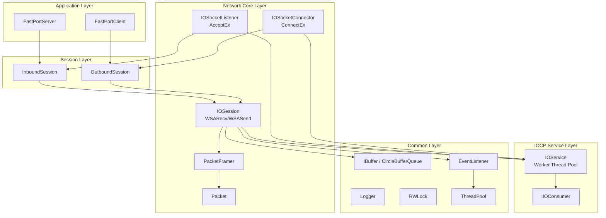
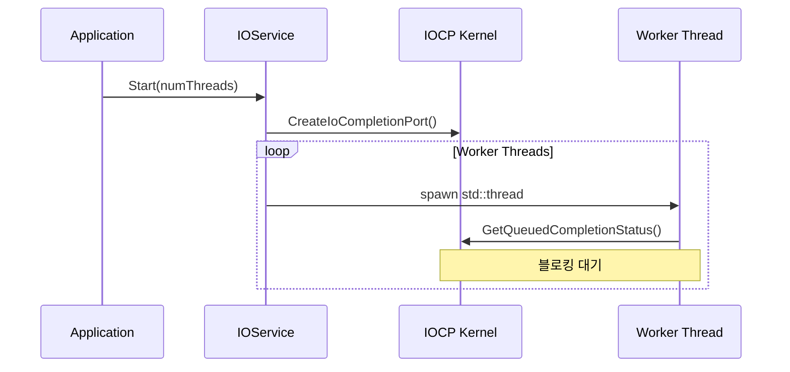
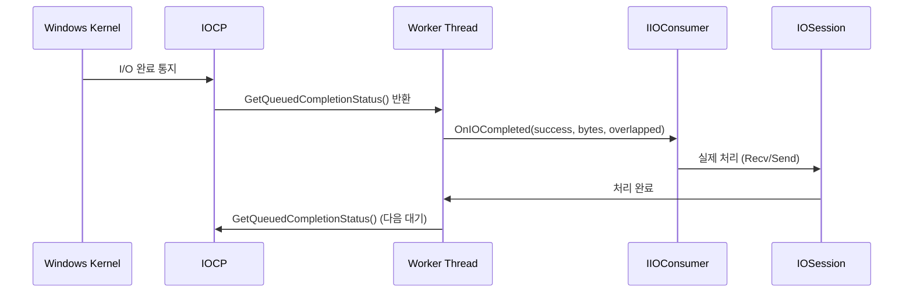
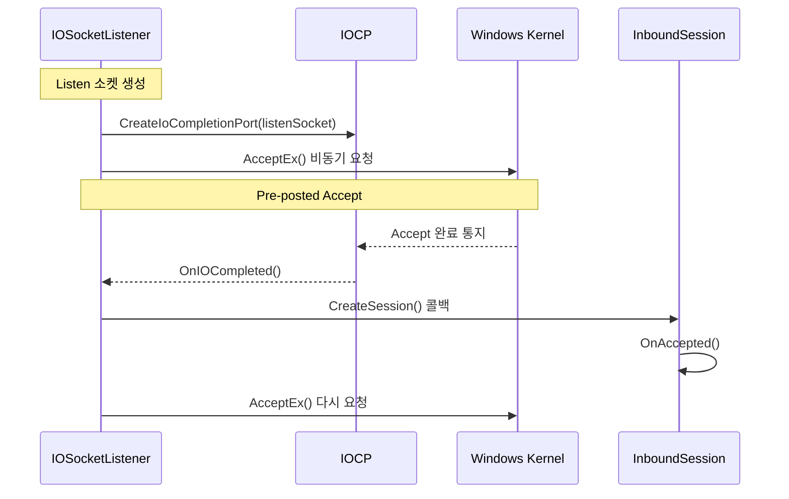
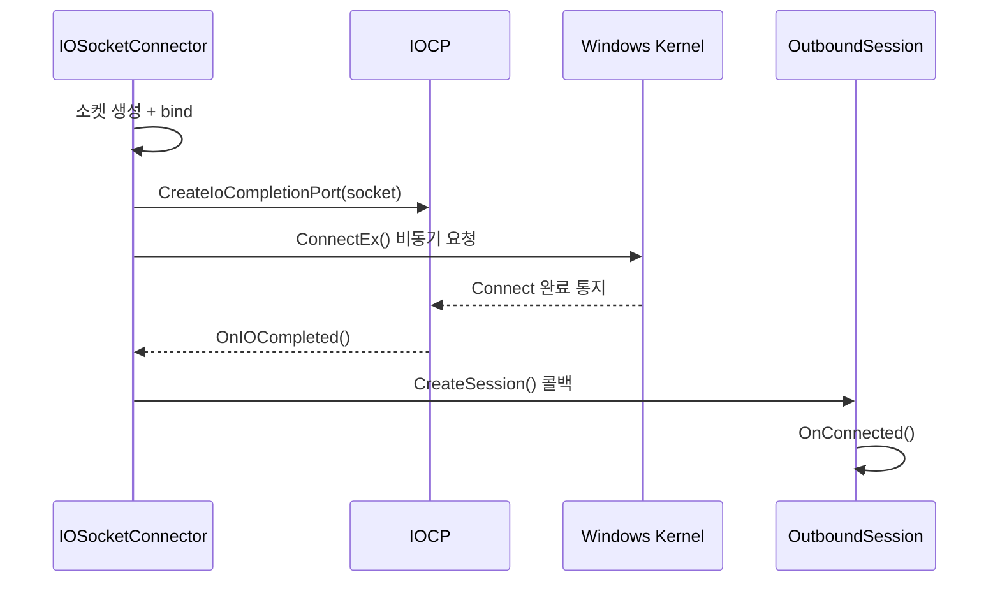
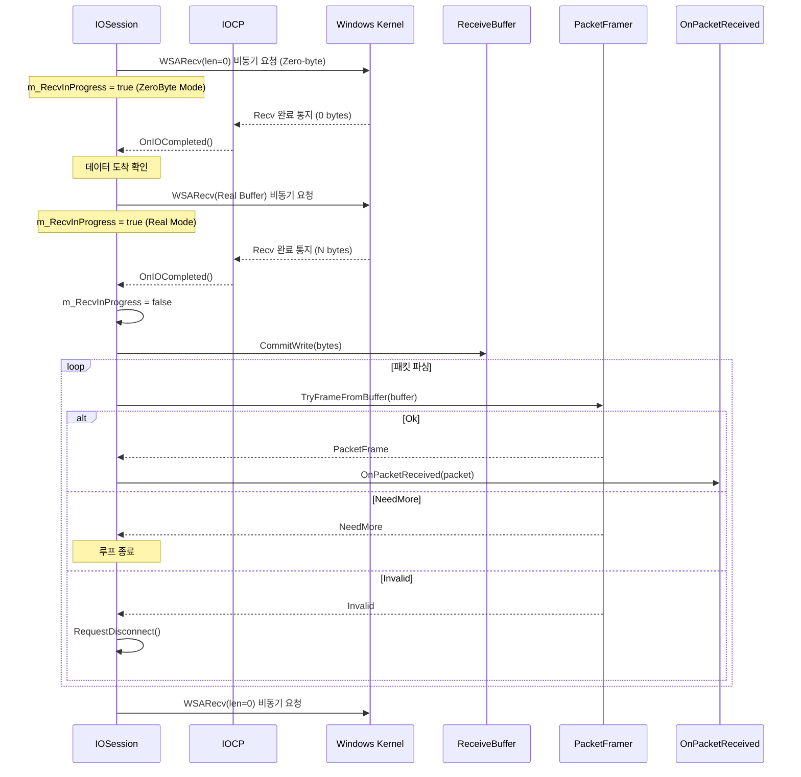
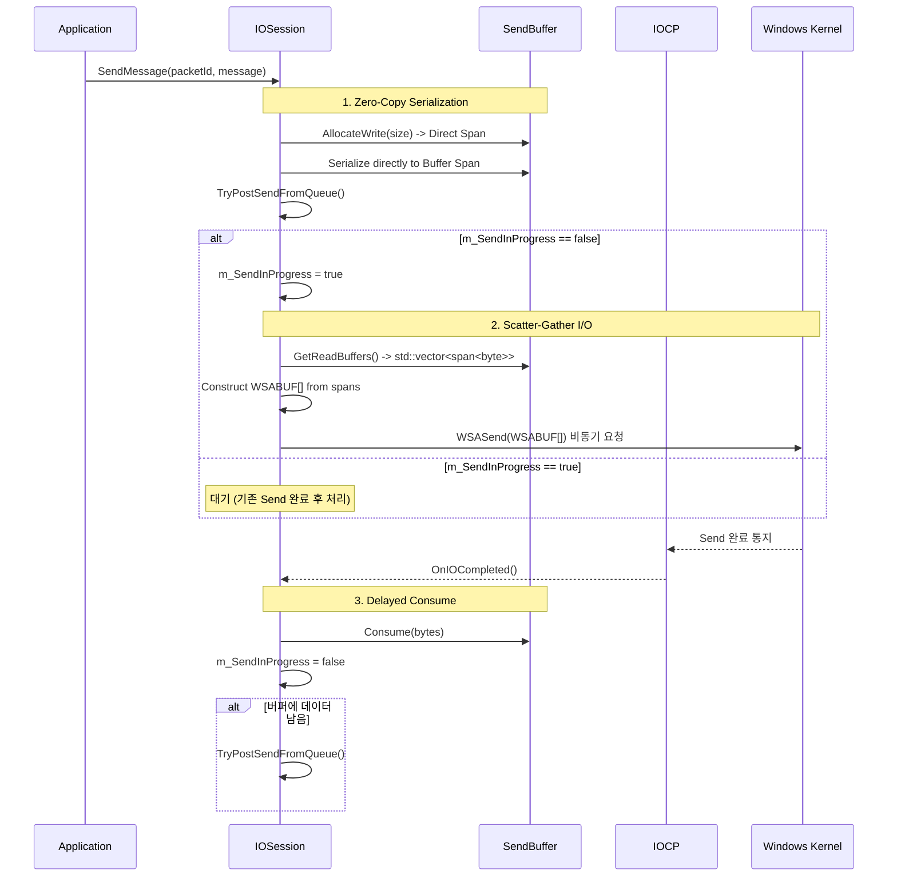
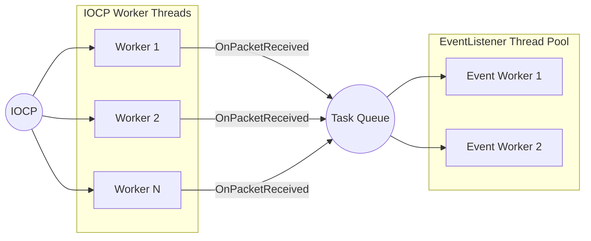

# IOCP 아키텍처

## 🏗️ 전체 아키텍처



---

## 🔄 IOCP 처리 흐름

### IOService 시작



### Completion 이벤트 처리



---

## 🔌 Accept 흐름 (서버)



---

## 🔗 Connect 흐름 (클라이언트)



---

## 📨 Send/Recv 흐름

### Recv 흐름



### Send 흐름



---

## 🔒 동기화 전략

### Atomic 플래그

| 플래그 | 용도 |
|--------|------|
| `m_RecvInProgress` | WSARecv outstanding 1개 유지 |
| `m_SendInProgress` | WSASend outstanding 1개 유지 |
| `m_DisconnectRequested` | 중복 disconnect 방지 |

### 동작 패턴

```cpp
bool expected = false;
if (!m_RecvInProgress.compare_exchange_strong(expected, true))
{
    return true;  // 이미 진행 중
}

// ... WSARecv 요청 ...

// 완료 시
m_RecvInProgress.store(false);
```

---

## 🧵 스레드 모델



### 역할 분담

| 스레드 | 역할 |
|--------|------|
| IOCP Worker | I/O 완료 처리, 패킷 파싱 |
| EventListener Worker | 패킷 처리 (비즈니스 로직) |

---

## ⚡ 성능 최적화 포인트

### 1. OVERLAPPED 재사용
```cpp
struct OverlappedEx
{
    OVERLAPPED Overlapped{};
    std::vector<char> Buffers{};
    size_t RequestedBytes = 0;
};

// 멤버 변수로 보유 (힙 할당 최소화)
OverlappedEx m_RecvOverlapped{};
OverlappedEx m_SendOverlapped{};
```

### 2. Pre-posted Accept
```cpp
// 미리 여러 개의 AcceptEx 요청
for (int i = 0; i < PRE_ACCEPT_COUNT; ++i)
{
    PostAccept();
}
```

### 3. Outstanding I/O 제한
```cpp
// Send는 1개만 outstanding
if (!m_SendInProgress.compare_exchange_strong(expected, true))
    return;

```

### 4. Send/Recv 최적화
```cpp
// Send: 링버퍼 직접 참조 (No Intermediate Copy)
WSABUF bufs[N];
for(auto& span : ring_buffer_spans)
    bufs[i] = { len, span.data };
WSASend(bufs);

// Recv: Zero-byte Recv (No Kernel Locking for idle connections)
WSARecv(len=0); // Notification only
```
