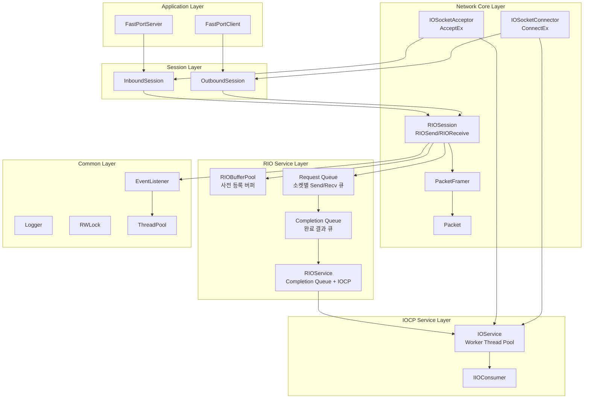
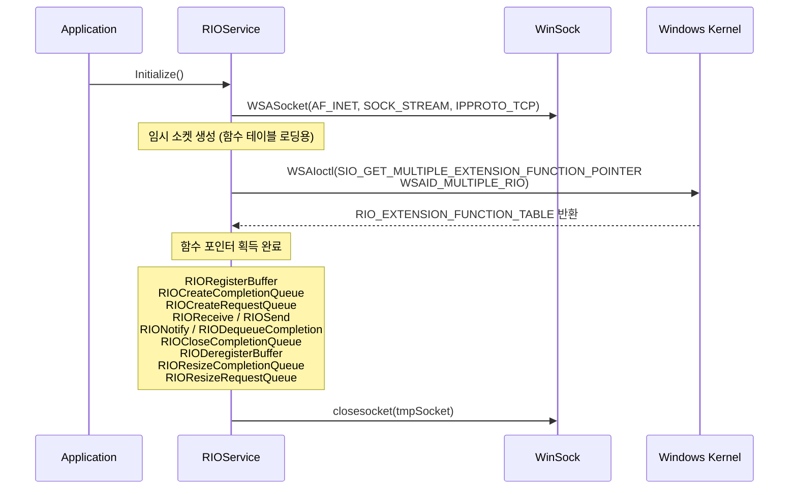
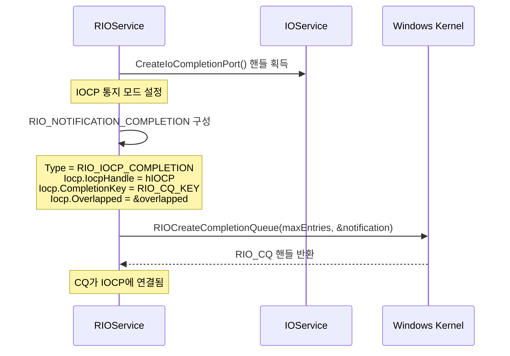
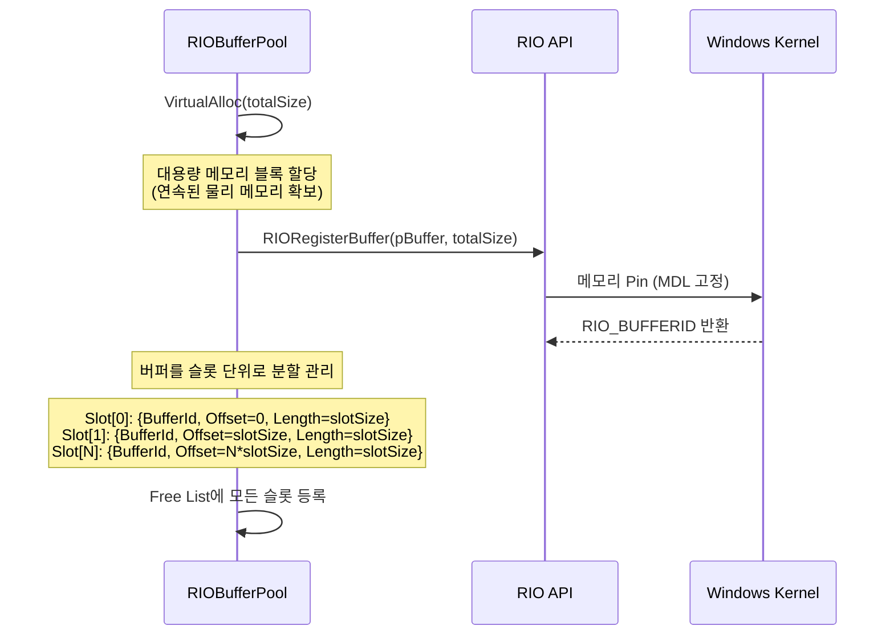
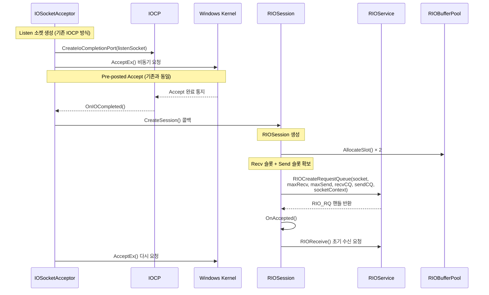
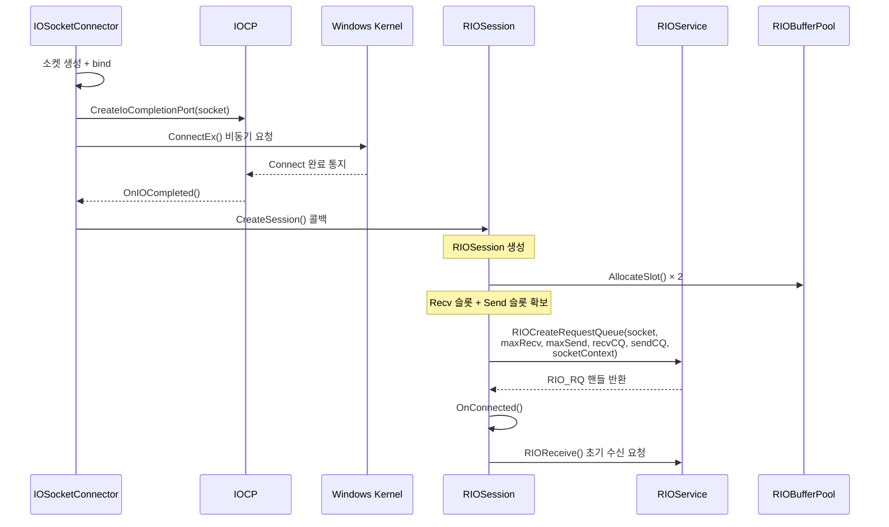
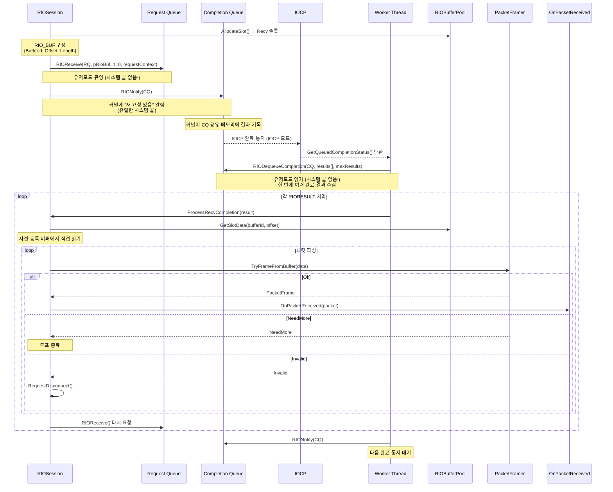
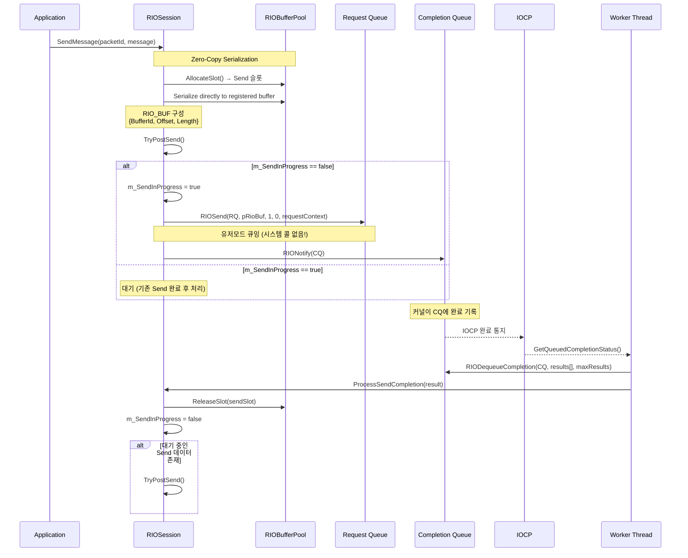
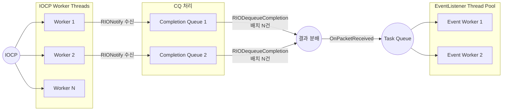
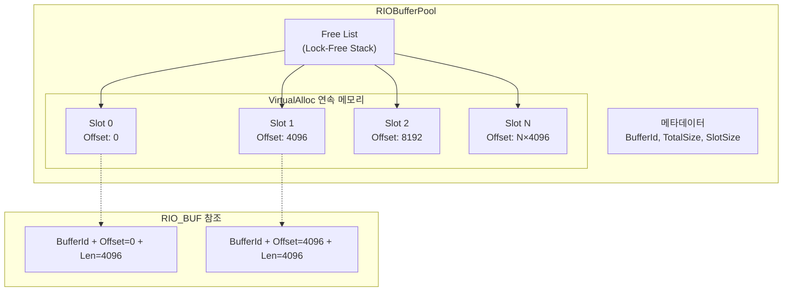

# RIO 아키텍처

## 🏗️ 전체 아키텍처



> **핵심 차이점**: Accept/Connect는 기존 IOCP(AcceptEx/ConnectEx)를 그대로 사용하고, 데이터 Send/Recv만 RIO로 대체합니다.

---

## 🔄 RIO 초기화 흐름

### RIO 함수 테이블 로딩



### Completion Queue 생성



### 버퍼 사전 등록



---

## 🔌 Accept 흐름 (서버)



---

## 🔗 Connect 흐름 (클라이언트)



---

## 📨 Send/Recv 흐름

### Recv 흐름



### Send 흐름



---

## 🔒 동기화 전략

### Completion Queue 동기화

> **중요**: `RIODequeueCompletion()`은 스레드 안전하지 않습니다. 하나의 CQ에 대해 동시에 여러 스레드가 Dequeue하면 안 됩니다.

| 전략 | 설명 |
|------|------|
| **CQ별 단일 스레드** | CQ 1개당 Worker 1개만 Dequeue (가장 간단) |
| **CQ 분리** | 소켓 그룹별 별도 CQ → 병렬 처리 가능 |
| **CriticalSection** | CQ 접근 시 락 사용 (성능 저하 가능) |

### Atomic 플래그 (IOCP와 동일 패턴)

| 플래그 | 용도 |
|--------|------|
| `m_SendInProgress` | RIOSend outstanding 1개 유지 |
| `m_DisconnectRequested` | 중복 disconnect 방지 |

### 동작 패턴

```cpp
// Send 중복 방지 (IOCP 패턴과 동일)
bool expected = false;
if (!m_SendInProgress.compare_exchange_strong(expected, true))
{
    return;  // 이미 전송 중
}

// ... RIOSend() 요청 ...

// 완료 시
m_SendInProgress.store(false);
```

### CQ Dequeue 보호

```cpp
// Worker Thread에서 CQ 접근
void OnRIOCompletionNotified(RIO_CQ cq)
{
    RIORESULT results[MAX_BATCH_SIZE];

    // RIODequeueCompletion은 스레드 안전하지 않음
    // → 하나의 CQ에 대해 단일 스레드만 호출
    ULONG numResults = g_RIO.RIODequeueCompletion(cq, results, MAX_BATCH_SIZE);

    for (ULONG i = 0; i < numResults; ++i)
    {
        auto* session = reinterpret_cast<RIOSession*>(results[i].SocketContext);
        session->OnIOCompleted(results[i]);
    }

    // 다음 통지 등록
    g_RIO.RIONotify(cq);
}
```

---

## 🧵 스레드 모델



### 역할 분담

| 스레드 | 역할 |
|--------|------|
| IOCP Worker | RIONotify 완료 수신, RIODequeueCompletion 배치 처리, AcceptEx/ConnectEx 완료 처리 |
| EventListener Worker | 패킷 처리 (비즈니스 로직) |

### IOCP Worker 루프

```cpp
void WorkerThread(HANDLE hIOCP)
{
    while (true)
    {
        DWORD bytes = 0;
        ULONG_PTR completionKey = 0;
        LPOVERLAPPED pOverlapped = nullptr;

        GetQueuedCompletionStatus(hIOCP, &bytes, &completionKey, &pOverlapped, INFINITE);

        if (completionKey == RIO_CQ_KEY)
        {
            // RIO 완료 통지
            OnRIOCompletionNotified(rioCQ);
        }
        else
        {
            // 기존 IOCP 처리 (Accept/Connect)
            OnIOCPCompleted(completionKey, bytes, pOverlapped);
        }
    }
}
```

---

## ⚡ 성능 최적화 포인트

### 1. 버퍼 사전 등록 (커널 잠금 제거)

```cpp
// 초기화 시 1회만 등록
void* pBuffer = VirtualAlloc(nullptr, TOTAL_BUFFER_SIZE,
                             MEM_COMMIT | MEM_RESERVE, PAGE_READWRITE);
RIO_BUFFERID bufferId = g_RIO.RIORegisterBuffer(
    reinterpret_cast<PCHAR>(pBuffer), TOTAL_BUFFER_SIZE);

// 이후 I/O에서는 BufferId + Offset만 전달
RIO_BUF rioBuf;
rioBuf.BufferId = bufferId;
rioBuf.Offset = slotIndex * SLOT_SIZE;
rioBuf.Length = SLOT_SIZE;
```

### 2. 유저모드 큐잉 (시스템 콜 최소화)

```cpp
// RIOSend/RIOReceive는 시스템 콜 없이 공유 메모리에 기록
g_RIO.RIOReceive(rq, &rioBuf, 1, 0, requestContext);  // 유저모드!
g_RIO.RIOSend(rq, &rioBuf, 1, 0, requestContext);      // 유저모드!

// RIONotify만 시스템 콜 (커널에 "확인해라" 알림)
g_RIO.RIONotify(cq);  // 시스템 콜 1회
```

### 3. 배치 Dequeue (한 번에 N건 수집)

```cpp
// 한 번의 호출로 최대 256건 결과 수집
constexpr ULONG MAX_RESULTS = 256;
RIORESULT results[MAX_RESULTS];

ULONG numResults = g_RIO.RIODequeueCompletion(cq, results, MAX_RESULTS);

// 배치 처리 → 오버헤드 분산
for (ULONG i = 0; i < numResults; ++i)
{
    ProcessCompletion(results[i]);
}
```

### 4. VirtualAlloc 정렬 할당

```cpp
// 페이지 경계 정렬로 TLB 효율 극대화
void* pBuffer = VirtualAlloc(
    nullptr,
    TOTAL_BUFFER_SIZE,
    MEM_COMMIT | MEM_RESERVE,
    PAGE_READWRITE);
```

---

## 📦 버퍼 관리

### RIOBufferPool 구조



### 슬롯 할당/해제

```cpp
struct RIOBufferSlot
{
    RIO_BUFFERID BufferId;
    ULONG Offset;
    ULONG Length;
    char* DataPtr;  // 직접 접근 포인터
};

class RIOBufferPool
{
    RIO_BUFFERID m_BufferId;
    char* m_pBaseAddress;
    std::stack<ULONG> m_FreeSlots;  // 사용 가능 슬롯 인덱스

    RIOBufferSlot AllocateSlot()
    {
        ULONG index = m_FreeSlots.top();
        m_FreeSlots.pop();
        return {
            .BufferId = m_BufferId,
            .Offset = index * SLOT_SIZE,
            .Length = SLOT_SIZE,
            .DataPtr = m_pBaseAddress + (index * SLOT_SIZE)
        };
    }

    void ReleaseSlot(ULONG index)
    {
        m_FreeSlots.push(index);
    }
};
```

### RIO_BUF 생성 패턴

```cpp
// 슬롯에서 RIO_BUF 구성
RIO_BUF MakeRIOBuf(const RIOBufferSlot& slot, ULONG dataLength)
{
    RIO_BUF buf;
    buf.BufferId = slot.BufferId;
    buf.Offset = slot.Offset;
    buf.Length = dataLength;
    return buf;
}
```

---

## 🔄 IOCP와 RIO 비교

### 주요 차이점

| 항목 | IOCP | RIO |
|------|------|-----|
| **Send/Recv 호출** | `WSASend/WSARecv` (시스템 콜) | `RIOSend/RIOReceive` (유저모드) |
| **버퍼 관리** | 매 I/O마다 커널 잠금/해제 | 사전 등록 1회, 이후 BufferId 참조 |
| **완료 확인** | `GetQueuedCompletionStatus` (시스템 콜) | `RIODequeueCompletion` (유저모드) |
| **배치 처리** | 1건씩 | N건 일괄 |
| **커널 전환** | 매 I/O마다 2회+ | `RIONotify` 1회만 |
| **Accept/Connect** | AcceptEx / ConnectEx | 미지원 → IOCP 사용 |
| **버퍼 타입** | `WSABUF` + 동적 메모리 | `RIO_BUF` + 사전 등록 메모리 |
| **구현 복잡도** | 중간 | 높음 (버퍼 풀 관리 필요) |

### I/O 처리 비용 비교

```
IOCP (매 I/O마다):
  ① 유저모드 → 커널모드 전환
  ② 버퍼 주소 검증 + MDL 잠금
  ③ I/O 수행
  ④ MDL 잠금 해제
  ⑤ 커널모드 → 유저모드 전환
  ⑥ 완료 통지 시스템 콜

RIO (매 I/O마다):
  ① 유저모드 큐에 엔트리 추가 (시스템 콜 없음)
  ② 커널이 사전 등록 버퍼로 직접 I/O
  ③ 유저모드 큐에서 결과 읽기 (시스템 콜 없음)
```

### RIO 선택 기준

| 상황 | 권장 |
|------|------|
| 소수의 연결, 대용량 전송 | IOCP |
| 다수의 연결, 소량 메시지 | **RIO** |
| 초저지연 요구 (μs 단위) | **RIO** |
| 높은 메시지 처리량 요구 | **RIO** |
| 단순한 구현 우선 | IOCP |
| Windows 7 이하 지원 필요 | IOCP |
