# 모듈 의존성

## 📊 모듈 의존성 다이어그램

```mermaid
graph TD
    subgraph Application
        FastPortServer[FastPortServer]
        FastPortClient[FastPortClient]
        FastPortInboundSession[fastport_inbound_session]
        FastPortOutboundSession[fastport_outbound_session]
    end

    subgraph LibNetworks
        IOService[networks.services.io_service]
        IOConsumer[networks.core.io_consumer]
        Socket[networks.core.socket]
        IOSocketListener[networks.core.io_socket_listener]
        IOSocketConnector[networks.core.io_socket_connector]
        IOSession[networks.sessions.io_session]
        InboundSession[networks.sessions.inbound_session]
        OutboundSession[networks.sessions.outbound_session]
        Packet[networks.core.packet]
        PacketFramer[networks.core.packet_framer]
    end

    subgraph LibCommons
        Logger[commons.logger]
        RWLock[commons.rwlock]
        SingleTon[commons.singleton]
        IBuffer[commons.buffers.ibuffer]
        CircleBufferQueue[commons.buffers.circle_buffer_queue]
        ThreadPool[commons.thread_pool]
        EventListener[commons.event_listener]
        Container[commons.container]
    end

    %% Application -> LibNetworks
    FastPortServer --> IOService
    FastPortServer --> IOSocketListener
    FastPortClient --> IOService
    FastPortClient --> IOSocketConnector
    FastPortInboundSession --> InboundSession
    FastPortOutboundSession --> OutboundSession

    %% LibNetworks internal
    IOSocketListener --> IOConsumer
    IOSocketListener --> Socket
    IOSocketListener --> IOService
    IOSocketConnector --> IOConsumer
    IOSocketConnector --> Socket
    IOSocketConnector --> IOService
    IOSession --> IOConsumer
    IOSession --> Socket
    IOSession --> Packet
    IOSession --> PacketFramer
    IOSession --> IBuffer
    IOSession --> EventListener
    InboundSession --> IOSession
    OutboundSession --> IOSession
    PacketFramer --> Packet
    PacketFramer --> IBuffer

    %% LibCommons internal
    CircleBufferQueue --> IBuffer
    CircleBufferQueue --> RWLock
    EventListener --> SingleTon
    EventListener --> ThreadPool
    Logger --> SingleTon
    Logger --> RWLock
    Container --> RWLock

    %% Cross-library
    IOSession --> Logger
    IOService --> Logger
    IOSocketListener --> Logger
    IOSocketConnector --> Logger
```



---

## 📋 모듈 목록

### LibNetworks 모듈

| 모듈 이름 | 파일 | 의존 모듈 |
|-----------|------|-----------|
| `networks.services.io_service` | `IOService.ixx` | `networks.core.io_consumer`, `commons.logger` |
| `networks.core.io_consumer` | `IOConsumer.ixx` | - |
| `networks.core.socket` | `Socket.ixx` | - |
| `networks.core.io_socket_listener` | `IOSocketListener.ixx` | `networks.core.io_consumer`, `networks.core.socket`, `commons.logger` |
| `networks.core.io_socket_connector` | `IOSocketConnector.ixx` | `networks.core.io_consumer`, `networks.core.socket`, `commons.logger` |
| `networks.sessions.io_session` | `IOSession.ixx` | `networks.core.io_consumer`, `networks.core.socket`, `networks.core.packet`, `networks.core.packet_framer`, `commons.buffers.ibuffer`, `commons.logger`, `commons.event_listener` |
| `networks.sessions.inbound_session` | `InboundSession.ixx` | `networks.sessions.io_session` |
| `networks.sessions.outbound_session` | `OutboundSession.ixx` | `networks.sessions.io_session` |
| `networks.core.packet` | `Packet.ixx` | - |
| `networks.core.packet_framer` | `PacketFramer.ixx` | `networks.core.packet`, `commons.buffers.ibuffer` |

### LibCommons 모듈

| 모듈 이름 | 파일 | 의존 모듈 |
|-----------|------|-----------|
| `commons.singleton` | `SingleTon.ixx` | - |
| `commons.rwlock` | `RWLock.ixx` | - |
| `commons.logger` | `Logger.ixx` | `commons.singleton`, `commons.rwlock` |
| `commons.buffers.ibuffer` | `IBuffer.ixx` | - |
| `commons.buffers.circle_buffer_queue` | `CircleBufferQueue.ixx` | `commons.buffers.ibuffer`, `commons.rwlock` |
| `commons.thread_pool` | `ThreadPool.ixx` | - |
| `commons.event_listener` | `EventListener.ixx` | `commons.singleton`, `commons.thread_pool` |
| `commons.container` | `Container.ixx` | `commons.rwlock` |

---

## 🔄 빌드 순서

C++20 모듈은 의존성 순서대로 빌드되어야 합니다.

### 1단계: 기반 모듈 (의존성 없음)
```
commons.singleton
commons.rwlock
commons.buffers.ibuffer
commons.thread_pool
networks.core.io_consumer
networks.core.socket
networks.core.packet
```

### 2단계: 1단계 의존
```
commons.logger
commons.buffers.circle_buffer_queue
commons.event_listener
commons.container
networks.core.packet_framer
```

### 3단계: 2단계 의존
```
networks.services.io_service
networks.sessions.io_session
```

### 4단계: 3단계 의존
```
networks.core.io_socket_listener
networks.core.io_socket_connector
networks.sessions.inbound_session
networks.sessions.outbound_session
```

### 5단계: 애플리케이션
```
fastport_inbound_session
fastport_outbound_session
FastPortServer (main)
FastPortClient (main)
```
