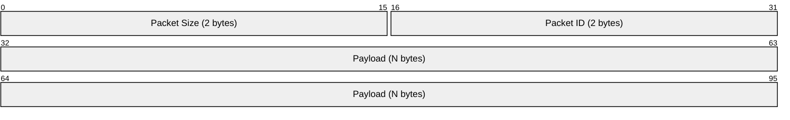
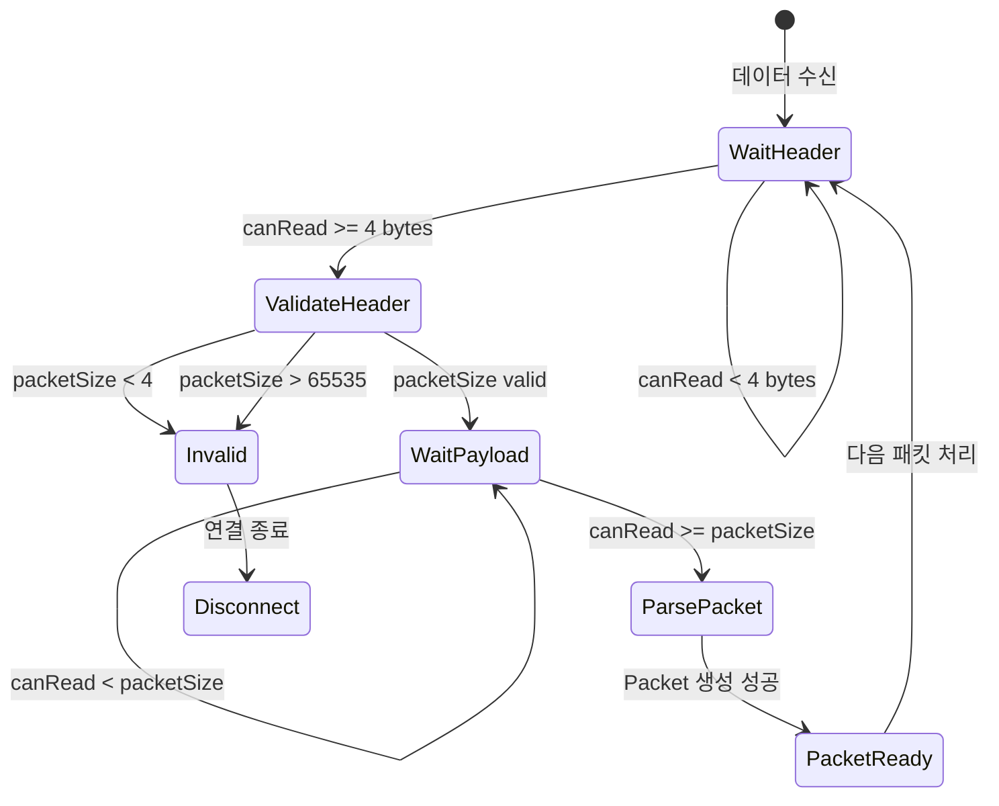

# 패킷 프로토콜 명세

## 📦 패킷 구조



### 헤더 필드

| 필드 | 오프셋 | 크기 | 바이트 순서 | 설명 |
|------|--------|------|-------------|------|
| **Size** | 0 | 2 bytes | Big-Endian (Network) | 전체 패킷 크기 (헤더 포함) |
| **Packet ID** | 2 | 2 bytes | Big-Endian (Network) | 메시지 타입 식별자 |
| **Payload** | 4 | N bytes | - | Protocol Buffers 직렬화 데이터 |

### 크기 제약

| 항목 | 값 |
|------|------|
| 최소 패킷 크기 | 4 bytes (헤더만) |
| 최대 패킷 크기 | 65,535 bytes (uint16_t 범위) |
| 헤더 크기 | 4 bytes |

---

## 🔄 바이트 순서 (Endianness)

모든 헤더 필드는 **Network Byte Order (Big-Endian)** 을 사용합니다.

### 인코딩 (송신)
```cpp
uint16_t sizeNet = htons(packetSize);    // Host → Network
uint16_t idNet = htons(packetId);        // Host → Network
```

### 디코딩 (수신)
```cpp
uint16_t packetSize = ntohs(sizeNet);    // Network → Host
uint16_t packetId = ntohs(idNet);        // Network → Host
```

---

## 📊 패킷 파싱 상태 머신



### 파싱 결과 (PacketFrameResult)

| 결과 | 설명 | 동작 |
|------|------|------|
| `Ok` | 패킷 파싱 성공 | `OnPacketReceived()` 호출 |
| `NeedMore` | 데이터 부족 | 다음 수신 대기 |
| `Invalid` | 프로토콜 위반 | 연결 종료 |

---

## 💾 Protocol Buffers 메시지

### Commons.proto

```protobuf
syntax = "proto3";
package protocols;

// 공통 메시지 정의
```

### Tests.proto

```protobuf
syntax = "proto3";
package protocols;

// 테스트용 메시지 정의
message TestRequest {
    string message = 1;
}

message TestResponse {
    string message = 1;
    int32 code = 2;
}
```

---

## 🔢 패킷 ID 정의

| Packet ID | 메시지 타입 | 방향 | 설명 |
|-----------|-------------|------|------|
| 0x0001 | TestRequest | C → S | 테스트 요청 |
| 0x0002 | TestResponse | S → C | 테스트 응답 |

> 패킷 ID는 애플리케이션에서 정의하며, `Packet::GetPacketId()`로 조회합니다.

---

## 📝 코드 예시

### 패킷 송신
```cpp
void SendTestRequest(const std::string& message)
{
    protocols::TestRequest request;
    request.set_message(message);

    SendMessage(0x0001, request);  // packetId = 1
}
```

### 패킷 수신
```cpp
void OnPacketReceived(const Core::Packet& packet) override
{
    switch (packet.GetPacketId())
    {
    case 0x0001:
        {
            protocols::TestRequest request;
            if (packet.ParseMessage(request))
            {
                // 처리
            }
        }
        break;
    case 0x0002:
        {
            protocols::TestResponse response;
            if (packet.ParseMessage(response))
            {
                // 처리
            }
        }
        break;
    }
}
```

---

## ⚠️ 에러 처리

### Invalid 패킷 조건

1. **패킷 크기가 헤더보다 작음** (`packetSize < 4`)
2. **패킷 크기가 최대값 초과** (`packetSize > 65535`)
3. **버퍼 읽기 실패** (`Peek()` / `Pop()` 실패)

### 처리 방식

```cpp
if (frame.Result == Core::PacketFrameResult::Invalid)
{
    logger.LogError("IOSession", "Invalid packet frame. Session Id: {}", GetSessionId());
    RequestDisconnect();
    return;
}
```
